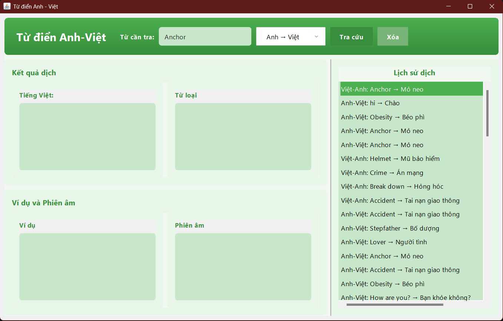
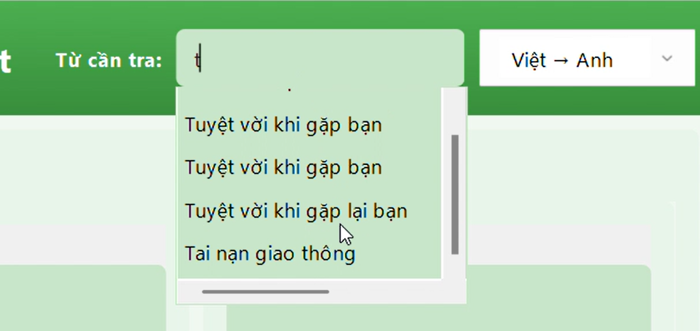
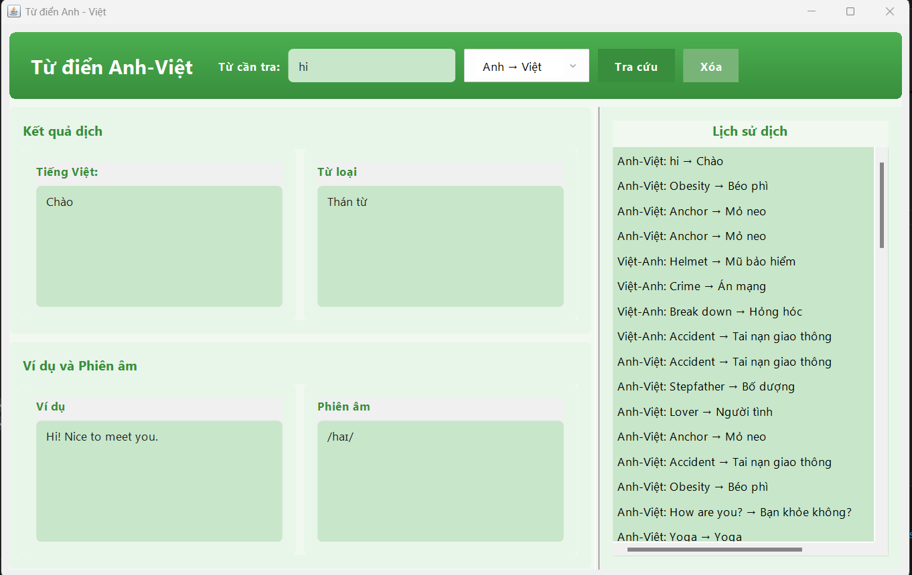
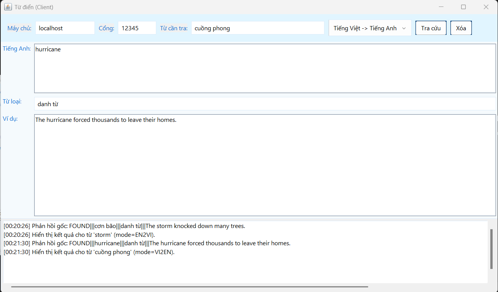
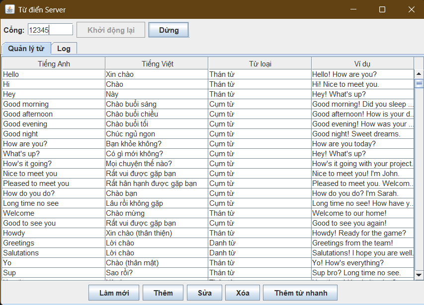
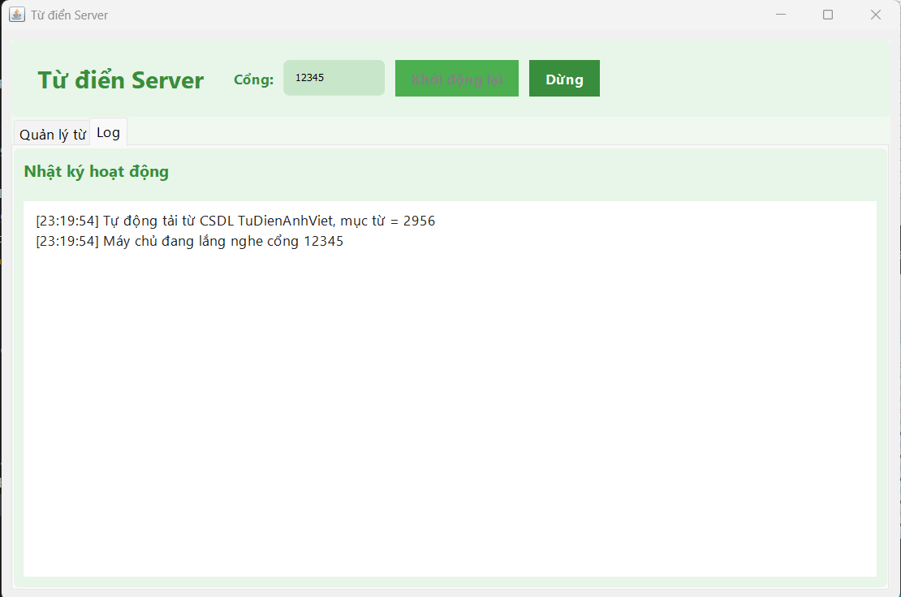
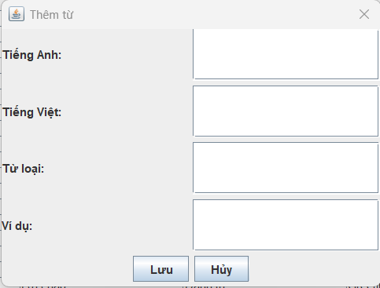
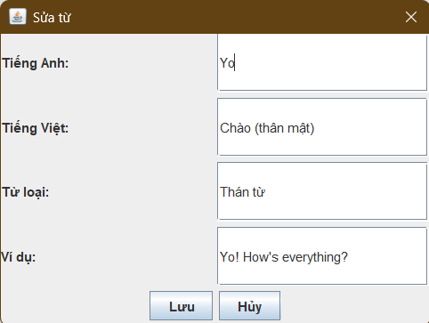
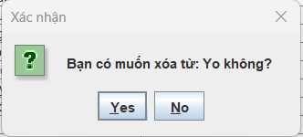

<h2 align="center">
    <a href="https://dainam.edu.vn/vi/khoa-cong-nghe-thong-tin">
    🎓 Faculty of Information Technology (DaiNam University)
    </a>
</h2>
<h2 align="center">
   ỨNG DỤNG TRA CỨU TỪ ĐIỂN ANH VIỆT SỬ DỤNG GIAO THỨC TCP
</h2>
<div align="center">
    <p align="center">
        
        
        
    </p>

[](https://www.facebook.com/DNUAIoTLab)
[](https://dainam.edu.vn/vi/khoa-cong-nghe-thong-tin)
[](https://dainam.edu.vn)

</div>

## 1. 📖 GIỚI THIỆU
Từ Điển Anh-Việt là ứng dụng từ điển trực tuyến được phát triển theo mô hình Client-Server, cho phép người dùng tra cứu từ vựng Anh-Việt và Việt-Anh một cách nhanh chóng và hiệu quả. Ứng dụng hỗ trợ tính năng gợi ý từ khóa thông minh, hiển thị đầy đủ thông tin bao gồm nghĩa, từ loại và ví dụ minh họa.

### ✨ Tính năng nổi bật:

- Tra cứu từ Anh sang Việt và Việt sang Anh

- Gợi ý từ khóa khi nhập

- Giao diện đồ họa thân thiện

- Log hoạt động chi tiết
- Quản lý từ trên giao diện

- Lưu trữ từ và lịch sử trong cơ sở dữ liệu

## 2. 💻 CÔNG NGHỆ SỬ DỤNG
<p align="center">
  
  
  
  
  
</p>


## 3. 🚀 HƯỚNG DẪN CÀI ĐẶT
### 📋 Điều kiện tiên quyết
- JDK 8 trở lên

- Restore lại CSDL để chương trình hoạt động đúng cách

### 🔧 Các bước cài đặt

1. **Clone repository:**
    ```bash
    git clone <https://github.com/namhung1910/UngDungTraCuuTuDienAnhViet.git>

    cd TuDienAnhViet
2. **Chuẩn bị dữ liệu:**
- Cài đặt MongoDB nếu chưa có.
- Khởi động MongoDB và đảm bảo đang hoạt động tại `mongodb://localhost:27017/`.
- Khôi phục cơ sở dữ liệu từ bản sao lưu:

        mongorestore --db AttendanceDB "đường-dẫn-đến-thư-mục-TuDienAnhVietDbBackUp\TuDienAnhViet"
- Ví dụ:

        mongorestore --db TuDienAnhViet "C:\Users\LENOVO\Documents\BTL_LTM_Nguyen_NamHung\src\TuDienAnhVietDbBackUp\TuDienAnhViet"

📌 Lưu ý:
-	Tránh trùng lặp cơ sở dữ liệu: Trước khi thực hiện restore, hãy kiểm tra xem MongoDB đã có cơ sở dữ liệu tên AttendanceDB chưa. Nếu có, bạn có thể gặp lỗi hoặc dữ liệu cũ có thể bị ghi đè.
-	Đảm bảo MongoDB đang chạy: Nếu MongoDB chưa được khởi động, lệnh mongorestore sẽ không hoạt động.
3. **Biên dịch chương trình:**
    ```bash
    javac -d bin TuDienAnhViet/*.java
4. **Khởi động Server:**
    ```bash
    java -cp bin TuDienAnhViet.Server
5. **Khởi động Client:**
    ```bash
    java -cp bin TuDienAnhViet.Client

## 4. 📸 HÌNH ẢNH CHƯƠNG TRÌNH
### 🖼️ Giao diện Client
- Giao diện chính của Client:
    <p align="center">
    
    </p>
- Giao diện gợi ý của Client:
    <p align="center">
    
    </p>
- Giao diện dịch từ tiếng Anh sang tiếng Việt:
    <p align="center">
    
    </p>
- Giao diện dịch từ tiếng Việt sang tiếng Anh:
    <p align="center">
    
    </p>
- Giao diện lịch sử dịch:
    <p align="center">
    
    </p>
### 🖥️ Giao diện Server
- Giao diện quản lý từ:
    <p align="center">
    
    </p>
- Giao diện quản lý log:
    <p align="center">
    
    </p>

- Giao diện thêm, sửa, xóa từ:  
<p align="center">
  
  
  
</p>

### 📞 Liên hệ: 
Nếu có thắc mắc hoặc góp ý, vui lòng liên hệ qua namhung1910@gmail.com

---
© 2025 Nguyễn Nam Hưng. All rights reserved.
