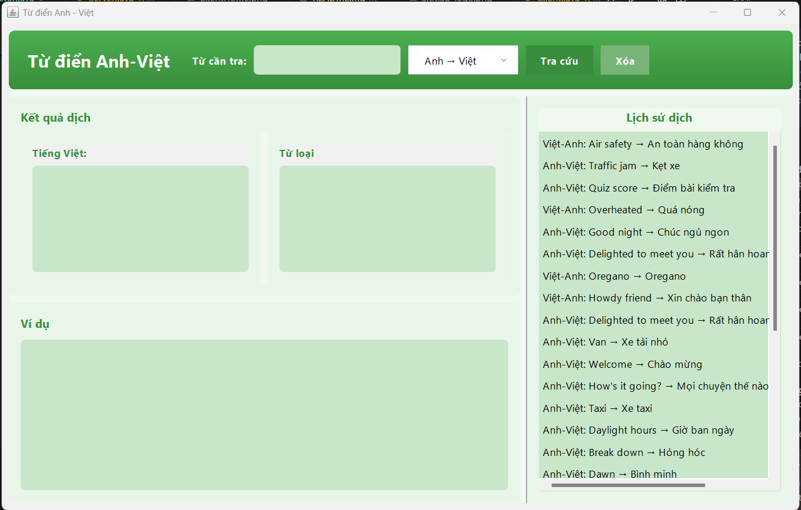
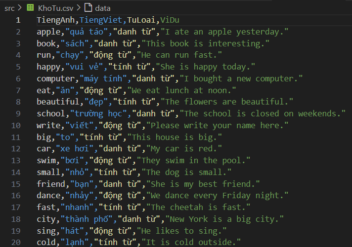

<h2 align="center">
    <a href="https://dainam.edu.vn/vi/khoa-cong-nghe-thong-tin">
    🎓 Faculty of Information Technology (DaiNam University)
    </a>
</h2>
<h2 align="center">
   ỨNG DỤNG TRA CỨU TỪ ĐIỂN ANH VIỆT
</h2>
<div align="center">
    <p align="center">
        
        
        
    </p>

[](https://www.facebook.com/DNUAIoTLab)
[](https://dainam.edu.vn/vi/khoa-cong-nghe-thong-tin)
[](https://dainam.edu.vn)

</div>

## 1. 📖 GIỚI THIỆU
Từ Điển Anh-Việt là ứng dụng từ điển trực tuyến được phát triển theo mô hình Client-Server, cho phép người dùng tra cứu từ vựng Anh-Việt và Việt-Anh một cách nhanh chóng và hiệu quả. Ứng dụng hỗ trợ tính năng gợi ý từ khóa thông minh, hiển thị đầy đủ thông tin bao gồm nghĩa, từ loại và ví dụ minh họa.

### ✨ Tính năng nổi bật:

- Tra cứu từ Anh sang Việt và Việt sang Anh

- Gợi ý từ khóa khi nhập

- Giao diện đồ họa thân thiện

- Log hoạt động chi tiết

- Hỗ trợ nhập dữ liệu từ file CSV

## 2. 💻 CÔNG NGHỆ SỬ DỤNG
### 🖥️ Client  
<p align="center">
  
  
</p>

### 🗄️ Server  
<p align="center">
  
  
  
</p>

### 📊 Data management  
<p align="center">
  
  
</p>


## 3. 🚀 HƯỚNG DẪN CÀI ĐẶT
### 📋 Điều kiện tiên quyết
- JDK 8 trở lên

- File dữ liệu từ vựng KhoTu.csv (theo định dạng: tienganh,tiengviet,tuloai,vidu)

### 🔧 Các bước cài đặt

1. **Clone repository:**
    ```bash
    git clone <https://github.com/namhung1910/UngDungTraCuuTuDienAnhViet.git>

    cd TuDienAnhViet
2. **Biên dịch chương trình:**
    ```bash
    javac -d bin TuDienAnhViet/*.java
3. **Chuẩn bị dữ liệu:**

- Đặt file KhoTu.csv trong thư mục src/ hoặc dùng nút "Tải dữ liệu" trong server để chọn file

4. **Khởi động Server:**
    ```bash
    java -cp bin TuDienAnhViet.Server
5. **Khởi động Client:**
    ```bash
    java -cp bin TuDienAnhViet.Client


### ⚙️ Cấu hình

- Server mặc định chạy trên cổng 12345

- Client mặc định kết nối đến localhost:12345

- Có thể thay đổi cổng và địa chỉ server trong giao diện

## 4. 📸 HÌNH ẢNH CHƯƠNG TRÌNH
### 🖼️ Giao diện Client
- Giao diện chính của Client:
    <p align="center">
    
    </p>
- Giao diện gợi ý của Client:
    <p align="center">
    
    </p>
- Giao diện dịch từ tiếng Anh sang tiếng Việt:
    <p align="center">
    
    </p>
- Giao diện dịch từ tiếng Việt sang tiếng Anh:
    <p align="center">
    
    </p>
### 🖥️ Giao diện Server
- Giao diện chính của Server:
    <p align="center">
    
    </p>

### 📊 Giao diện kho từ CSV
- Một phần của kho từ:
    <p align="center">
    
    </p>

### 📞 Liên hệ: 
Nếu có thắc mắc hoặc góp ý, vui lòng liên hệ qua namhung1910@gmail.com

---
© 2025 Đại ca Nam Hưng. All rights reserved.
